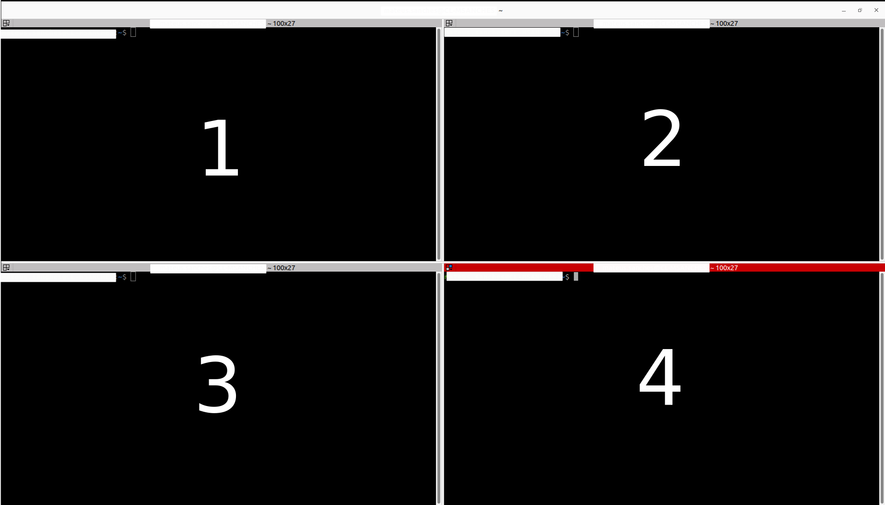
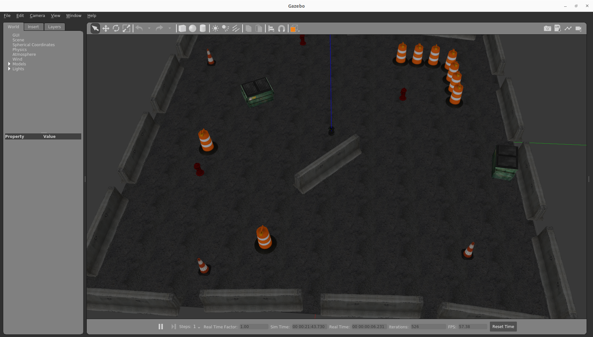
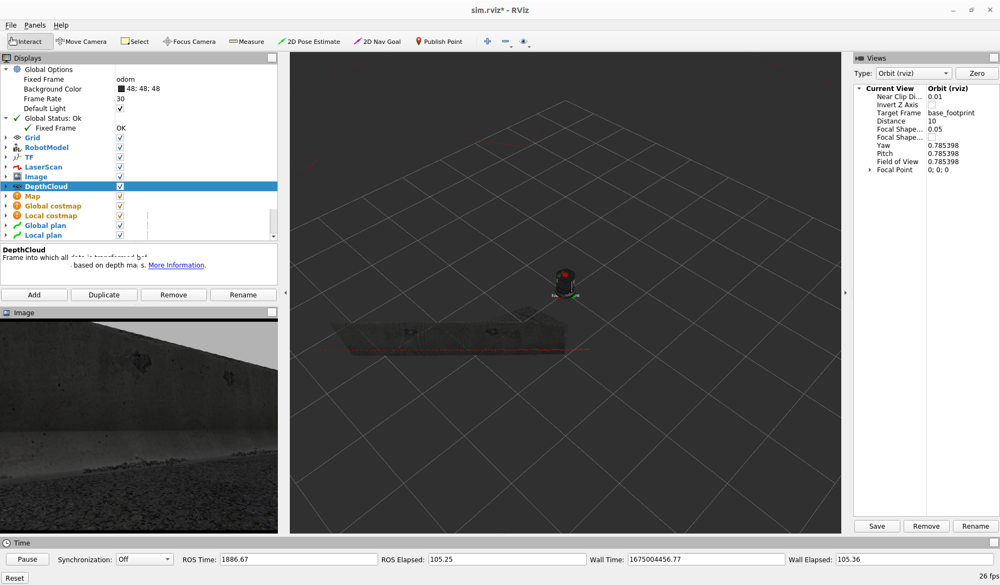
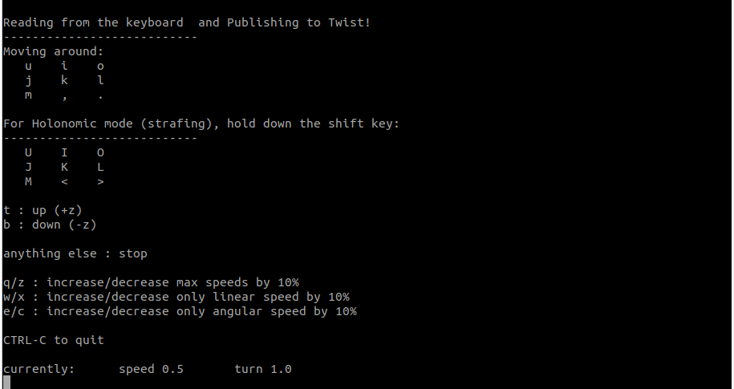
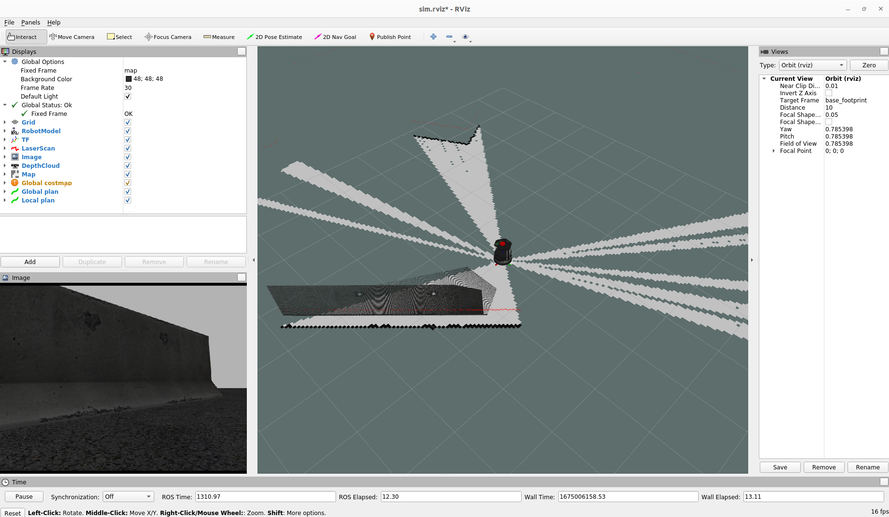
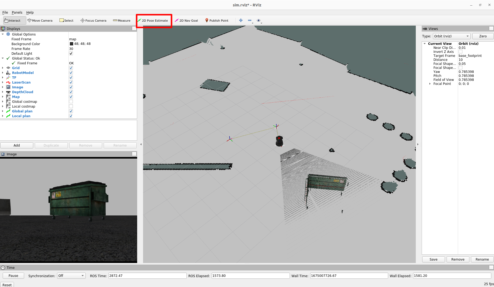
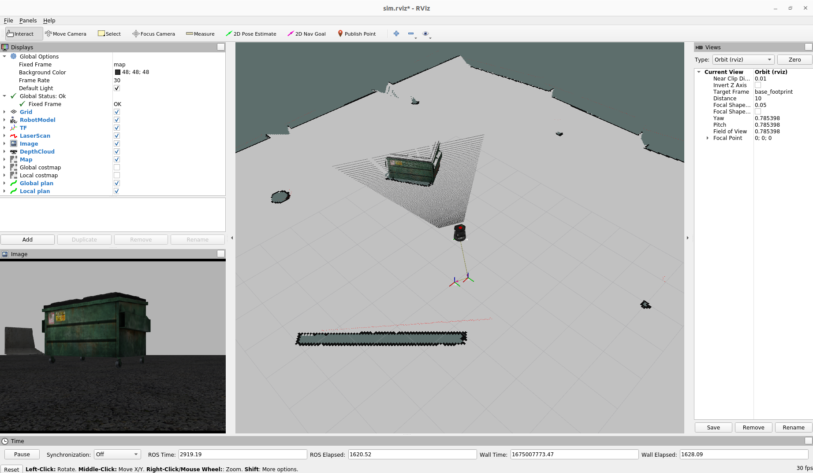
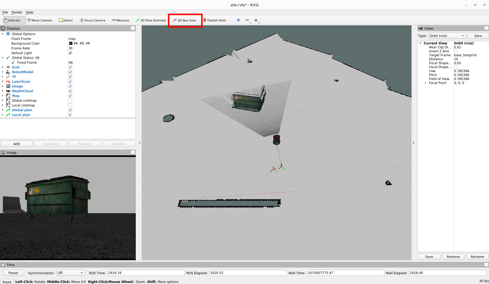
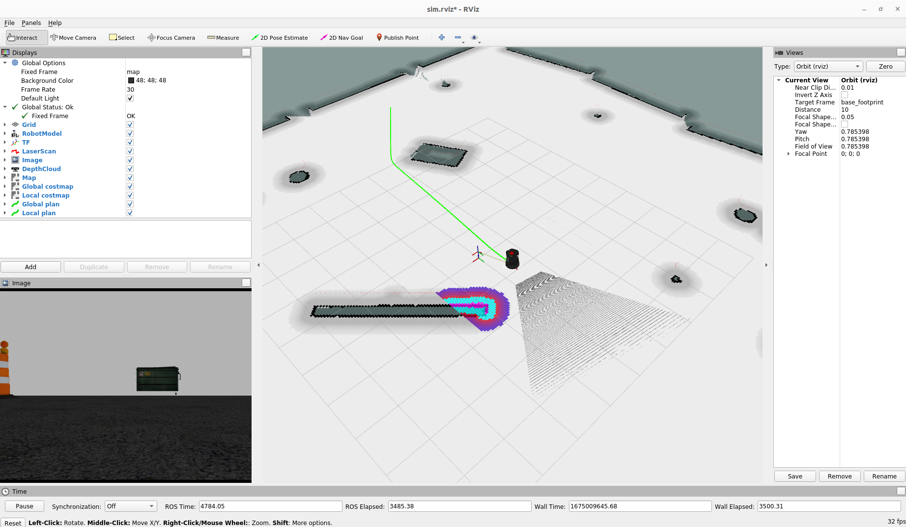

# iaac_turtlebot_noetic

Code repository for the IAAC mobile robotics workshop practice with the TurtleBot2 running in ROS Noetic (Ubuntu 20.04).

## Summary

By using this repository, you will be able to run mobile robotics demonstrations in simulated and real environments with the TurtleBot2, including sensor reading, teleoperation, mapping, localization, and autonomous navigation.

This repository contains the following sub-folders:
- **iaac_turtlebot_demos**: Contains launch files and configurations for running the demonstrations.
- **turtlebot_packages**: All packages needed to run core TurtleBot functions and related demos (adapted to ROS Noetic).

## Installation
Below are the steps for installation, please follow them carefully (you can directly copy and paste the following commands in a terminal).

**Note:** These instructions have been tested in a PC with Ubuntu 20.04 and [ROS Noetic](http://wiki.ros.org/noetic/Installation) installed.

- Create a ROS workspace:
```
cd ~/
mkdir -p iaac_ws/src
```
- Clone this repository inside the created workspace: 
```
cd iaac_ws/src
git clone https://github.com/mourams/iaac_turtlebot_noetic.git
```
- Install required dependencies using the `rosdep` tool:
```
cd ..
rosdep install --from-paths src --ignore-src -r -y
```
- Compile the packages. 
```
catkin_make
```
- Source the generated files for being able to run the demos. **Remember that for every new terminal you need to enter this command!**
```
source ~/iaac_ws/devel/setup.bash
```

## Running the demos

You can use [terminator](https://gnome-terminator.org/) for easily splitting a window into multiple terminals. 
- Open a new Terminator window (Ctrl+Alt+T). 
- Right-click the terminal, and click "Split horizontally" and "Split vertically" to spawn new terminals according to the desired layout.

For the following instructions, we will use to a 4-terminal layout referenced in a numbered fashion (Terminal 1, 2, 3...) as seen below:



## Simulation (with Gazebo)

- To run the simulation, go to **Terminal 1** and run the turtlebot simulation launch file (*roscore* is automatically launched here):
```
roslaunch iaac_turtlebot_demos turtlebot_playpen.launch
```
After waiting for the Gazebo simulator to launch, you should be able to see the following interface:



Try interacting with the simulator to see how it works.

## Visualization (with RViz)

- In order to visualize sensor data and robot transforms, you need to launch the ROS visualizer (RViz). You can do so, in **Terminal 2**, by simply typing `rviz` or, preferably, launching the visualized already configured for the demos:
```
roslaunch iaac_turtlebot_demos rviz.launch
```
By running such command you should see another window:



You can explore RViz by enabling/disabling sensor topics, see TF frames, and changing perspectives, for example.

## Keyboard-based teleoperation

You can see the robot model and sensors, however you cannot move it yet! For enabling teleoperation, we use the [teleop_twist_keyboard](http://wiki.ros.org/teleop_twist_keyboard) ROS package that allows us to control the robot velocity from keystrokes. 

- First, open a new **Terminator** window, right-click on its title bar, and click on the "Always on top" option. Since we are going to interact directly with this terminal, we need to have it always visible!
- Then, launch the following file to run the teleoperation node while remapping (i.e. connecting) to the topic that send velocity commands to the TurtleBot:
```
roslaunch iaac_turtlebot_demos teleoperation.launch
```

In the same terminal a message will appear, explaining how to move the robot. Try varying the angular and linear speeds and moving around! Note that the robot will only move if you have this window active (by clicking on it).



## Simultaneous localization and mapping (SLAM) with GMapping

For autonomous navigation, the robot should be able to localize itself accurately and reliably inside the environment where it is placed. This is usually done through a SLAM algorithm, in this case we are using the standard [GMapping](http://wiki.ros.org/gmapping) ROS package to map the surroundings and localize the TurtleBot at the same time.
- Go back to the previous **Terminator** window. In **Terminal 3**, run the following file to launch GMapping:
```
roslaunch iaac_turtlebot_demos slam.launch
```
You should be able to see in RViz an occupancy grid, as seen below:



This is the environment map, which is being built by GMapping based on the robot's odometry and laser sensor scans. The bright areas mean free, while the dark ones are occupied. Gray zones are unknown. 

- First, make sure that the **Fixed Frame** in the Global Options tab in RViz is set to `map`. 
- Move the robot around, and you should see the map being updated to include the areas explored. Try covering most of the environment, as you will use this map later!

- Once you have a good map, save it by running in **Terminal 4**, the following command (you can change the `mymap` map name to any name that you like):
```
rosrun map_server map_saver -f mymap
```
This will generate two files: `mymap.pgm` and `mymap.yaml`, containing the map and associated metadata (information about its size, resolution, etc.). 
- Move the files generated to the `maps` folder inside the **iaac_turtlebot_demos** package.

## Localization with a built map (AMCL)

Once your map is built and you do not want to further update it, you can use it to localize the robot using the [AMCL](http://wiki.ros.org/amcl) particle filter. 

**Note:** we cannot run GMapping and AMCL at the same time, otherwise we will have conflicting positions coming from two different sources! 

- First, terminate the GMapping ROS node (click on **Terminal 3** and press Ctrl+C to kill the process).
- We also need to tell the map server which map to load. Run `localization.launch` file inside **iaac_turtlebot_demos**, setting the `map_file` argument to the name of the map that you generated (`mymap` if you have not changed its name).
```
roslaunch iaac_turtlebot_demos localization.launch map_file:=mymap
```
You should then see again the occupancy grid map you built loaded into RViz. However, **it is likely that your robot is not localized (i.e. *lost*)**! This happens because AMCL was not told the initial position of the TurtleBot. It can try to estimate the position from robot odometry and laser scans, but if it is too far off it cannot do on its own.

To fix this, you need to tell AMCL the robot's position. Do so by clicking on the "2D Pose Estimate" button in RViz:



- Then, click on the map, around the region where you estimate the robot could be. Hold your mouse left button and move the green arrow to estimate the robot orientation as well (this part is important to help AMCL determine correctly where the robot is heading). You can use distinctive objects (such as the green bin in the image above) to help you identify the robot location.
- AMCL will then correct your robot pose and improve its localization as the robot moves and the laser scans are matched with the existing map. The scans and map should align such as seen below:



- Voilà! Your robot is correctly localized. If that part fails, or if the robot gets lost again, you can always set the robot pose again using the RViz 2D Pose Estimate tool.

## Autonomous navigation with move_base

Now that your robot is localized in your environment, it can navigate autonomously. We use the ROS navigation stack with [move_base](http://wiki.ros.org/move_base) to plan global and local trajectories over the occupancy grid map, considering the environment obstacles.
- To launch move_base with pre-configured parameters for the TurtleBot, run in **Terminal 4**:
```
roslaunch iaac_turtlebot_demos navigation.launch
```
In RViz you should see the global (shaded) and local (colored) costmaps appearing over the built map, indicating the static (from map) and dynamic (perceived by the sensors) obstacles, respectively.
- Try sending the TurtleBot to some (free) position in the 2D map. Use the "2D Nav Goal" tool in RViz to send a goal pose:



Similar to the 2D Pose Estimate, you need to hold your mouse left button and move the arrow to define the desired robot orientation.

- You should see the generated global path (green line) as seen below:



The local path (in red) is also generated but may not be visible in RViz as it is short.

- Wait for the robot to reach its goal. If the robot gets stuck for some reason, try to send the goal again using the RViz tool.

Congratulations! Now your TurtleBot is navigating autonomously. Try sending a couple paths in harder situations (e.g.: between obstacles).

## Running demos in the real robot

With the obvious exception of simulation, all previously noted launch files and configurations are also applicable to an actual TurtleBot. However, a few checks are necessary before starting to play around with the real robot:

- **Close all running nodes** launched before in the terminals (press Ctrl+C on each of them).
- Make sure that you are connected to the same network as the robot, and that you can reach it (for example, by pinging to its IP).
- You should add your own IP and hostname, as well as the robot's, to the `/etc/hosts` file using any text editor (you need to run as `sudo` to edit it).
- Setup the following environment variables to interact with the ROS nodes and topics of the robot. **Remember to do so for each terminal**:
```
export ROS_MASTER_URI=http://[ROBOT_HOST_NAME]:11311
export ROS_HOSTNAME=[YOUR_PC_HOST_NAME]
```
- Repeat the previous instructions to launch all demos.

Everything should work as before. However, be aware that in real life, things normally are **a bit** more complex than in simulation!